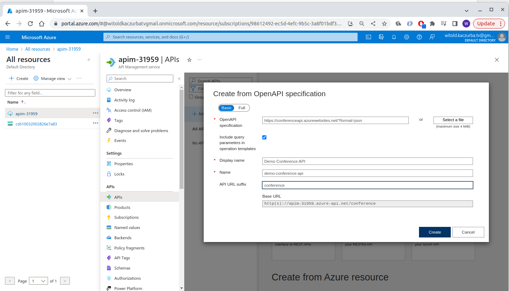
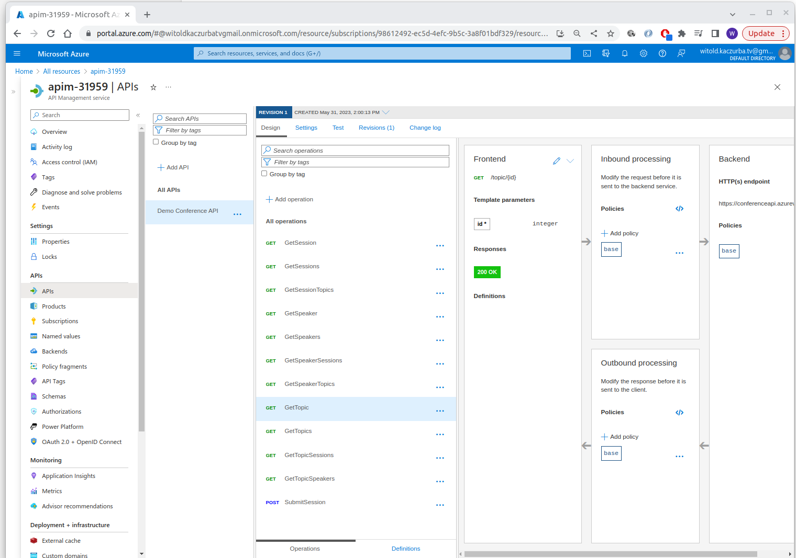
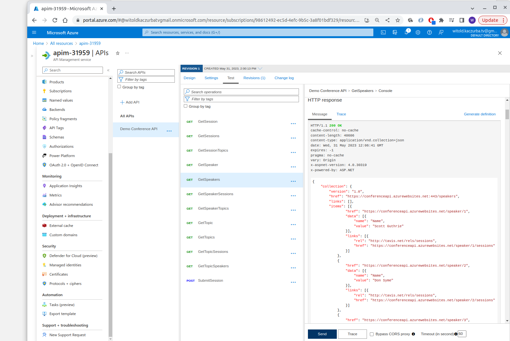

# Discover the API Management Service

**Tutorial**: [here](https://learn.microsoft.com/en-ie/training/modules/explore-api-management/)


## API management components:

What are the differences between:
 - API Gatweway
 - management plane
 - developer portal


Products: open/protected

Groups: `administrators`, `developers`, `guests`

Policies

## Managing:

- Managed
- Self-hosted

## Policies

### Policy configuration

 - policy XML file: - `inbound`/`outbound`/`on-error`

### Policyh expressions:

 - `@(expression)` - C# one-liner
 - `@{expression}` - C# multi-liner

**Example**
- setting header with User.Id from context. - [here](https://learn.microsoft.com/en-ie/training/modules/explore-api-management/4-api-management-policies#policy-expressions)
- policies specified at different scopes
- filter response content (using `choose`) - [here](https://learn.microsoft.com/en-ie/training/modules/explore-api-management/4-api-management-policies#filter-response-content)


## Creating advanced policies

Code samples are [here](
    https://learn.microsoft.com/en-ie/training/modules/explore-api-management/5-create-advanced-policies)


 - control flow (`choose`)
 - forward reqeust (`forward-request`)
 - limit concurrency (`limit-concurrency`) - eg. throttling 429
 - log to event hub (`log-to-eventhub`)
 - mock response (`mock-response`)
 - retry (`retry`)
 - return response (`return-response`)

## Securing subscription

 - keys
 - header `Ocp-Apim-Subscription-Key`
   - eg. `curl --header "Ocp-Apim-Subscription-Key: <key string>" https://<apim gateway>.azure-api.net/api/path`

 ## Securing APIs by using certs.


  - TLS (CA/Thumbrint/subject/expiration date)

### Accepting client certs in the Consumption tier
...


More: [here](https://learn.microsoft.com/en-ie/training/modules/explore-api-management/7-secure-access-api-certificates)


## Exercise - creating an API managment ([src](https://learn.microsoft.com/en-ie/training/modules/explore-api-management/8-exercise-import-api))


Creating an APIM (API Management) instance

GIST: [https://gist.github.com/wkaczurba/d38753d32f595d4b663dcdc84579cd1f](https://gist.github.com/wkaczurba/d38753d32f595d4b663dcdc84579cd1f)

```bash
#!/bin/bash

# Login if not created:
#az login

echo "Specify your email:"
read MY_EMAIL

RESOURCE_GROUP=apim-demo1-rg
MY_APIM_NAME=apim-$RANDOM
MY_LOCATION=westeurope
PUBLISHER_NAME="APIDemo_Publisher"

echo MY_EMAIL=$MY_EMAIL
echo RESOURCE_GROUP=$RESOURCE_GROUP
echo MY_APIM_NAME=$MY_APIM_NAME
echo MY_LOCATION=$MY_LOCATION
echo PUBLISHER_NAME=$PUBLISHER_NAME

if [ $(az group exists --name $RESOURCE_GROUP) = false ]; then
    echo Creating resource group $rg:
    az group create --resource-group $RESOURCE_GROUP --location westeurope
else
    echo Resource group $RESOURCE_GROUP exists. Not creating.
fi

echo Creating APIM...
az apim create -n $MY_APIM_NAME \
    --location $MY_LOCATION \
    --publisher-email $MY_EMAIL  \
    --resource-group $RESOURCE_GROUP \
    --publisher-name $PUBLISHER_NAME \
    --sku-name Consumption

```
Then go to APIM, create new API - from `https://conferenceapi.azurewebsites.net/?format=json`



After importing:



**Then the backend spec.:**

Go into API -> select "Settings"
 - check webservice URL
 - deselect "Subscription required" box.
 - save

Test -> from "Test tab"


# TODO:

Elaborate on security of APIM:
 - [Ms://learn.microsoft.com/en-us/azure/api-management/api-management-policies#authentication-policies](https://learn.microsoft.com/en-us/azure/api-management/api-management-policies#authentication-policies)
 - GOOD ONE: [Authentication-Policies](https://learn.microsoft.com/bs-latn-ba/azure/api-management/api-management-policies#authentication-policies)
 - Main options for backend Managed Identity
   - Basic
   - Client Certs
     -  More on clients certs here - [Azure AD Certrificate-based authentication](https://learn.microsoft.com/en-us/azure/active-directory/authentication/concept-certificate-based-authentication)

   - Managed Identity

# TODO2:

Discuss caching + caching policies.
 - show example based on this one: https://learn.microsoft.com/en-us/azure/api-management/set-edit-policies?tabs=form
 
 - look at https://youtu.be/NQUDkd96sUo?t=574 TODO - descrbe policies as such
