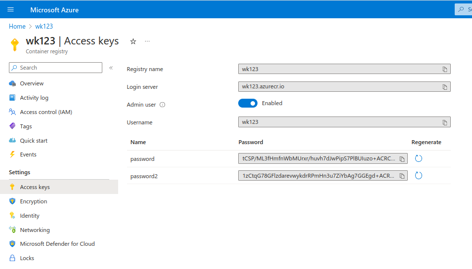
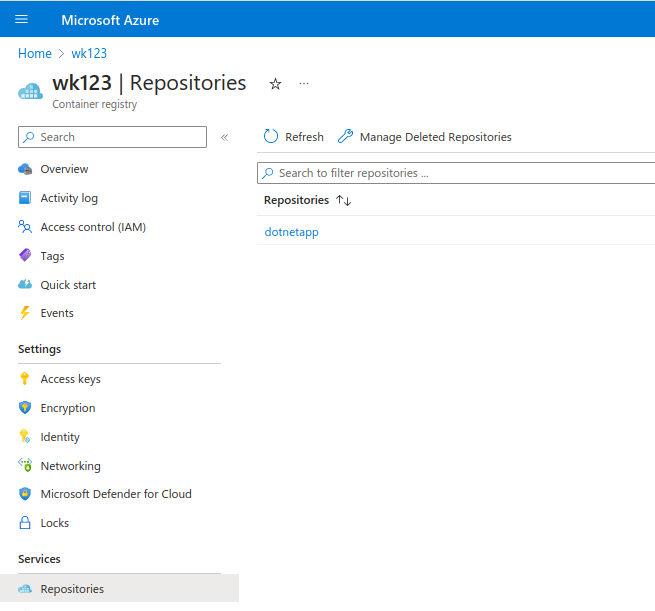
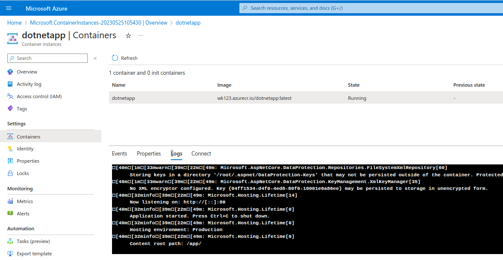

- [Dockerfile .NET on Ubuntu](#dockerfile-net-on-ubuntu)
  - [Running non-Docker .dotnet on Ubuntu first.](#running-non-docker-dotnet-on-ubuntu-first)
  - [Dockerized Windows dotnet:](#dockerized-windows-dotnet)
- [Azure Container Registry (ACR)](#azure-container-registry-acr)
  - [Setting up ACR](#setting-up-acr)
  - [Pushing into ACR](#pushing-into-acr)
    - [Logging-in](#logging-in)
    - [Tagging + pushing:](#tagging--pushing)
  - [Permissions](#permissions)
- [Azure Instances](#azure-instances)
  - [Creating Azure Instance:](#creating-azure-instance)
- [Docker - multistage build for dotnet.](#docker---multistage-build-for-dotnet)
  - [Single-stage:](#single-stage)
  - [Multi-stage:](#multi-stage)
- [Container group deployments](#container-group-deployments)
  - [Blobs - lifecycle policy JSON:](#blobs---lifecycle-policy-json)
  - [Conditional headers for blob-service operations](#conditional-headers-for-blob-service-operations)
  - [Time0based retention policies for immutable blob data](#time0based-retention-policies-for-immutable-blob-data)
  - [Immutable leagl hold - overview](#immutable-leagl-hold---overview)


# Dockerfile .NET on Ubuntu 

## Running non-Docker .dotnet on Ubuntu first.

Simply dotnet + name of dll should work but failed in my case. 

**Gotchas:**

(Non-docker dotnet): When trying to directly use donet with DLLs on Ubuntu got apt packages mixed-up on 22.04

Here is ther fix:
https://stackoverflow.com/questions/73753672/a-fatal-error-occurred-the-folder-usr-share-dotnet-host-fxr-does-not-exist

## Dockerized Windows dotnet:

1. example from [AZ-204: Implement containerized solutions >  Manage container images in Azure Container Registry > Explore elements of a Dockerfile](https://learn.microsoft.com/en-ie/training/modules/publish-container-image-to-azure-container-registry/5-dockerfile-components)

2. my example: https://github.com/wkaczurba/BasicDotnet/commit/52b553041fb2a5d885d3ff227568837e4e328a75

**Running Gotchas on Ubuntu:**
 - had issues exposing port 80. `docker run -p 80:80 dotnetapp` did not run first, so check netstat first.s


# Azure Container Registry (ACR)

## Setting up ACR

Just create. SKUs: standard seems ok.
Premium allows private access only + CMK encryption.

Enable admin access



## Pushing into ACR

### Logging-in 

Make sure `az` command line is installed.

This one should be sufficient to log-in with OAuth:

 - `az login`
 - `az acr login --name <NAME OF ACR container registry.>`

Alternatively:

- `az acr login --name wk123 --user wk123 --password IEDQZC+4mCSYX3HbEpda5/ABFgjg...rR+A...mmh`

### Tagging + pushing:

```bash
docker tag dotnetapp wk123.azurecr.io/dotnetapp
docker push wk123.azurecr.io/dotnetapp
```  
  where wk123 is repo's name. Voila:



## Permissions

Good description of permissions is here [Azure Container Registry roles and permissions](https://learn.microsoft.com/en-us/azure/container-registry/container-registry-roles?tabs=azure-cli).

Particularly interesting role is `AcrPush` that allows just for pushing/pulling images.

# Azure Instances

## Creating Azure Instance:

Options for Image source:
 - Quickstart images
 - Azure Container Registry
 - Other registry

Networking:
 - public (with public IP)
 - private (not working on Windows containers)
 - none (cmd line acces only)

Advanced: 
 - Restart policies (eg. on fail, never, always)
 - Env vars, key managment

Just start...

**LOGS** are in Settings blade -> Containers -> [Container-name] -> Logs:



# Docker - multistage build for dotnet.

Docker + dotnet:
https://hub.docker.com/_/microsoft-dotnet

## Single-stage:

```docker
FROM mcr.microsoft.com/dotnet/aspnet:6.0
WORKDIR /app
COPY . .
EXPOSE 80
ENTRYPOINT ["dotnet", "BasicDotnet.dll"]
```

## Multi-stage:

My working example:
 - https://github.com/wkaczurba/BasicDotnet/commit/f14a4d35426b706a2ab33434995e3e62efa05a6b

```docker
FROM mcr.microsoft.com/dotnet/sdk:6.0 as build
WORKDIR /source

COPY *.csproj ./
RUN dotnet restore

COPY . .
RUN dotnet publish -c Release -o out

# final stage/image
FROM mcr.microsoft.com/dotnet/aspnet:6.0
WORKDIR /app
COPY --from=build /source/out .
EXPOSE 80
ENTRYPOINT ["dotnet", "BasicDotnet.dll"]
```

# Container group deployments

**UDEMY**: https://www.udemy.com/course/azure-certification-1/learn/lecture/31939138#overview

**Microsoft docs/tutorial:**

Tested and followed this one - all easy steps:
 - https://learn.microsoft.com/en-us/azure/container-instances/container-instances-multi-container-yaml

 - Simply `az container create --resource-group may25th --file deploy-aci.yaml`


## Blobs - lifecycle policy JSON:

- blobs: lifecycle policy json like - "tierToCool", "delete", - [examples]
([Lifecycle management policy definition](https://learn.microsoft.com/en-us/azure/storage/blobs/lifecycle-management-policy-configure?tabs=azure-portal#code-view))

- "enableAutoTierToHotFromCool" [https://learn.microsoft.com/en-us/dotnet/api/microsoft.azure.management.storage.models.managementpolicybaseblob.enableautotiertohotfromcool?view=azure-dotnet](https://learn.microsoft.com/en-us/dotnet/api/microsoft.azure.management.storage.models.managementpolicybaseblob.enableautotiertohotfromcool?view=azure-dotnet)
  - moves to hot on accessing it, but also requires the other way: tierToCool.daysAfterLastAccessTimeGreaterThan...


## Conditional headers for blob-service operations

You can specified what file you expect to get by supplying additional request headers like:
 -  `If-Modified-Since` + DateTime value (as per RFC1123)
 -  `If-Match` an etag value
[https://docs.microsoft.com/en-us/rest/api/storageservices/specifying-conditional-headers-for-blob-service-operations](https://docs.microsoft.com/en-us/rest/api/storageservices/specifying-conditional-headers-for-blob-service-operations)

## Time0based retention policies for immutable blob data

[https://learn.microsoft.com/en-us/azure/storage/blobs/immutable-time-based-retention-policy-overview](https://learn.microsoft.com/en-us/azure/storage/blobs/immutable-time-based-retention-policy-overview)
 - the idea is that we enable immutability +set the time-basewd retention policy scope (version-level policy or container-level policy
 - and object immutability...
 - > A time-based retention policy stores blob data in a Write-Once, Read-Many (WORM) format for a specified interval. When a time-based retention policy is set, clients can create and read blobs, but can't modify or delete them. After the retention interval has expired, blobs can be deleted but not overwritten.

 ## Immutable leagl hold - overview


 [https://learn.microsoft.com/en-us/azure/storage/blobs/immutable-legal-hold-overview](https://learn.microsoft.com/en-us/azure/storage/blobs/immutable-legal-hold-overview)
