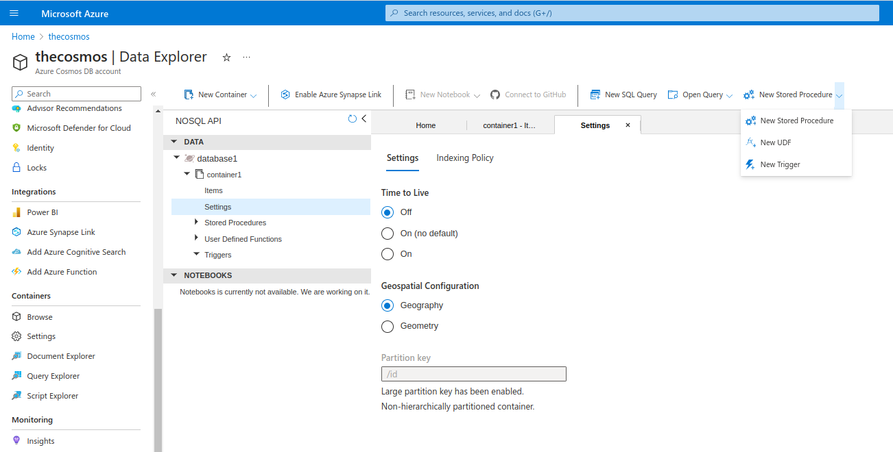

# Cosmodb:

Generally the tutorial does not provide much examples information about how to use cosmodb for APPS.
I could not find how to read actual data from containers using `azure cli`.

Simple DB + container + item creation for NOSQL CosomosDB is here: [https://github.com/wkaczurba/az204-cosmos](https://github.com/wkaczurba/az204-cosmos)

## Consistency levels:

## Supported APIs:
  - NoSQL
  - MongoDB
  - PostgreSQL
  - Apache Cassandra (column-oriented...)
  - Table (replacement for Table storage)
  - Apache Gremlin

## RUs modes:
 - Provisioned throughput mode (increments of 100RUs/sec); can change levels programatically 
 - Serverless mode
 - Autoscale mode (for unpredictable traffice patterns that require SLAs on high performance and scale)

## Database vs containers

  Documentation from [Microsoft is here](https://learn.microsoft.com/en-us/azure/cosmos-db/resource-model)
 
  Database is a namespace that can hold group of contgainers.

 - NOSQL API
   - database
      -  container1
      -  container2
      -  container3...
   -  database2
      -  container4...
      -  container5...

## Stored procs

Official tutorial: [Create stored procedures](https://learn.microsoft.com/en-ie/training/modules/work-with-cosmos-db/4-cosmos-db-stored-procedures)
 - Tutorial exmaples are not always working as expected (returning errors)
 - Original samples provided by Azure Portal work better.

## Pre/post-triggers.

TODO: Pretrigger did not work as expected. Try it again.

## Change feed

Official tutorial here: [Explore change feed in Azure Cosmos DB](https://learn.microsoft.com/en-ie/training/modules/work-with-cosmos-db/6-cosmos-db-change-feed)

Push model:
 - Azure Functions Azure Cosmos DB triggers: [here Azure Functions bindings for Cosmos DB](https://learn.microsoft.com/en-us/azure/azure-functions/functions-bindings-cosmosdb-v2-trigger)
 - change feed processor library - .NET v3 or Java V4 SDK. Components:
    - monitored container - container that has the data from which the change feed is generated. Any changes inserts/updates to the monitored container are reflected in the chnage feed of the container.
    - lease container - container for tracking progress/coordination across workers
    - compute instance - ref to actual host for code (VM, AKS pod, Azure App Service or actual physical machine)
    - delegate - code the defines what to do once batch of changes is read.

Java - change feed tutorial:
  - [https://learn.microsoft.com/en-us/azure/cosmos-db/nosql/how-to-java-change-feed](https://learn.microsoft.com/en-us/azure/cosmos-db/nosql/how-to-java-change-feed)

## Cosmos - Table API:

 - [CloudTableClient class docs](https://learn.microsoft.com/en-us/dotnet/api/microsoft.azure.cosmos.table.cloudtableclient?view=azure-dotnet)
