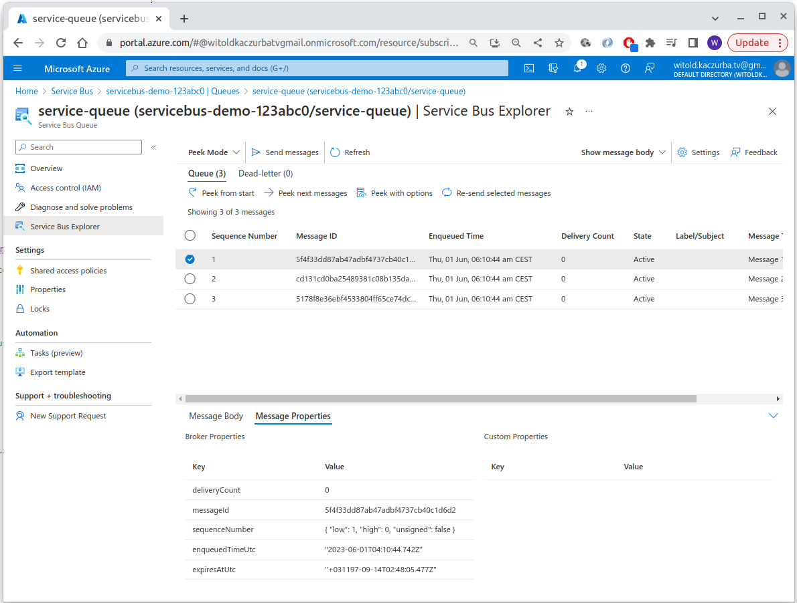

# Eventgrid + EventHub

- [Eventgrid + EventHub](#eventgrid--eventhub)
  - [Eventgrid](#eventgrid)
    - [Exercise - route custom events to web endpoint by using Azure CLI](#exercise---route-custom-events-to-web-endpoint-by-using-azure-cli)
  - [Eventhub](#eventhub)
    - [Event Hubs Capture tutorial - eventhubs capture](#event-hubs-capture-tutorial---eventhubs-capture)
    - [Scale your processing app tutorial](#scale-your-processing-app-tutorial)
    - [Control access to events tutorial](#control-access-to-events-tutorial)
- [Message-based solutions](#message-based-solutions)
  - [Service bus](#service-bus)
    - [Basics:](#basics)
    - [Service bus queues, topics and subscriptions](#service-bus-queues-topics-and-subscriptions)
    - [Service bus  message payloads and serialization](#service-bus--message-payloads-and-serialization)
    - [Send+receive message from a Service Bus queue by using .NET](#sendreceive-message-from-a-service-bus-queue-by-using-net)
  - [Queues](#queues)
    - [Basics](#basics-1)
    - [Create + manage Azure Queue Storage and messages by using .NET](#create--manage-azure-queue-storage-and-messages-by-using-net)

## Eventgrid

eventgrid
schemas
deliovery durability
control access to events
receive events by using webhooks
filter events

### Exercise - route custom events to web endpoint by using Azure CLI

[Tutorial source](https://learn.microsoft.com/en-ie/training/modules/azure-event-grid/8-event-grid-custom-events)

**Registering a provider:** 
 - Can be done using AZ: `az provider register --namespace Microsoft.EventGrid` (then progress can be  monitored using `az provider show -n Microsoft.EventGrid`
 - Or through the portal itself:
  


The code below will setup eventgrid + create ARM-based webapp that gets the events. Example event to be send:

```json
[
  {
    "id": "2601",
    "eventType": "recordInserted",
    "subject": "myapp/vehicles/motorcycles",
    "eventTime": "2023-06-01T04:40:46+0200",
    "data": {
      "make": "Contoso",
      "model": "Monster"
    },
    "dataVersion": "1.0"
  }
]
```


GIST source: [https://gist.github.com/wkaczurba/e9940d689e6a764c56777e31c1b77211](https://gist.github.com/wkaczurba/e9940d689e6a764c56777e31c1b77211)
 
```bash
#!/bin/bash

# Login if not created:
#az login

RANDOM_SUFFIX="4def88"

RESOURCE_GROUP=eventgrid-demo-${RANDOM_SUFFIX}-rg
MY_LOCATION=westeurope
MY_TOPIC_NAME=eg-topic-${RANDOM_SUFFIX}
MY_SITE_NAME=eg-site-${RANDOM_SUFFIX}
MY_SITE_URL="https://${MY_SITE_NAME}.azurewebsites.net"

if [ $(az group exists --name $RESOURCE_GROUP) = false ]; then
    echo Creating resource group $RESOURCE_GROUP:
    az group create --resource-group $RESOURCE_GROUP --location $MY_LOCATION
else
    echo Resource group $RESOURCE_GROUP exists. Not creating.
fi

# Enabling eventgrid resource provider
# NOTE: Needed only on subscription w/o Microosft.EventGrid enabled - go in portal: subscription -> resource-providers

az provider register --namespace Microsoft.EventGrid

# Creating a custom topic.

az eventgrid topic create --name $MY_TOPIC_NAME --location $MY_LOCATION --resource-group $RESOURCE_GROUP

# Creating a webapp - endpoint (using Azure's samples)

az deployment group create --resource-group $RESOURCE_GROUP \
    --template-uri "https://raw.githubusercontent.com/Azure-Samples/azure-event-grid-viewer/main/azuredeploy.json" \
    --parameters siteName=$MY_SITE_NAME hostingPlanName=viewerhost

echo "The web app URL: ${MY_SITE_URL}"

# Subscribe to a custom topic:

ENDPOINT="${MY_SITE_URL}/api/updates"
SUB_ID=$(az account show --subscription "" | jq -r '.id')

az eventgrid event-subscription create \
    --source-resource-id "/subscriptions/$SUB_ID/resourceGroups/$RESOURCE_GROUP/providers/Microsoft.EventGrid/topics/$MY_TOPIC_NAME" \
    --name az2204viewerSub \
    --endpoint $ENDPOINT

# Send an event:

# Retrieving URL+key for custom topic:
TOPIC_ENDPOINT=$(az eventgrid topic show --name $MY_TOPIC_NAME -g $RESOURCE_GROUP --query "endpoint" --output tsv)
KEY=$(az eventgrid topic key list --name $MY_TOPIC_NAME -g $RESOURCE_GROUP --query "key1" --output tsv)

EVENT='[ {"id": "'"$RANDOM"'", "eventType": "recordInserted", "subject": "myapp/vehicles/motorcycles", "eventTime": "'`date +%Y-%m-%dT%H:%M:%S%z`'", "data":{ "make": "Contoso", "model": "Monster"},"dataVersion": "1.0"} ]'

curl -X POST -H "aeg-sas-key: $KEY" -d "$EVENT" $TOPIC_ENDPOINT
```


## Eventhub

### Event Hubs Capture [tutorial - eventhubs capture](https://learn.microsoft.com/en-ie/training/modules/azure-event-hubs/3-event-hubs-capture)
 - durable telemetry ingestion
 - capturing stuff into Azurew Blob Storage/Azure Data Lake Storage
   - format: `{Namespace}/{EventHub}/{PartitionId}/{Year}/{Month}/{Day}/{Hour}/{Minute}/{Second}`
 - Apache Avro format
 - 1 to 20 throghput units @ 1MB per sec/1000 events

 
### Scale your processing app [tutorial](https://learn.microsoft.com/en-ie/training/modules/azure-event-hubs/4-event-processing)

1. Idea of scaling application throuhg partitoned consumers: `EventProcessorClient` .NET/Java, `EventHubConsumerClient` for Python/Javascript
2. Discusses Scaling/Load balancing/Seamless resume on failures/Consumption of messages
3. Some similarities to Kinesis Client Library (AWS) but KCL/Kinesis did not have partitions/separate topics as such - KCL subscribed to shards.

More on the Client itself: [https://learn.microsoft.com/en-us/dotnet/api/azure.messaging.eventhubs.eventprocessorclient?view=azure-dotnet](https://learn.microsoft.com/en-us/dotnet/api/azure.messaging.eventhubs.eventprocessorclient?view=azure-dotnet)

### Control access to events [tutorial](https://learn.microsoft.com/en-ie/training/modules/azure-event-hubs/5-event-hubs-authentication-authorization)

Access - as for other services:
 - Azure Event Hub Data Owner - complete access
 - Azure Event Hub Data Sender
 - Azure Event Hub Data Receiver

Authorization using:
 - Managed Identities
 - Microsoft Identity Platform
 - SAS (to Event Hubs publishers and cosnumers)
 
[Perform common operations with the event hubs client library](https://learn.microsoft.com/en-ie/training/modules/azure-event-hubs/6-event-hubs-programming-guide)

Describes:
 - standalone: Publishing, Reading, Reading from partition
 - **Event Processor Client**-based processing of events (prefered, idea somewhat similar to KCL in AWS)

# Message-based solutions

Service bus vs Queues:
  - **Service bus**: allows for long-polling (unlike Queues), FIFO, deduplication/detection of duplication, `session ID`, trnascational/atomic. support for <256kBytes.
  - **Storage queues:** up to 80GB, tracking progress (peek+lock/delete), "side logs" of processed messages.

## Service bus

### Basics:

**Tiers:**
 - **Premium** (predictability, high throughput, fixed pricing) up to 100MB
 - **Standard** variability, pay-as-you-go (up to 256kBytes)

Advanced features:
  - message sessions
  - autoforwarding (eg. queue-chaining)
  - DLQ
  - **scheduled delivery + message deferral** (eg. delayed processing - can set visibility for after a certain time)
  - batching
  - transactions (execution scopes)
  - **filtering+actions** - can filter subscription based on various rules
  - autodelete on idle
  - duplicate detection
  - security protocols
  

### Service bus queues, topics and subscriptions

[ref: tutorial](https://learn.microsoft.com/en-ie/training/modules/discover-azure-message-queue/4-queues-topics-subscriptions)

 - Queues
 - Receive modes:
   - Receiver + delete - deletion on reception; missed events are liekly
   - Peek lock (like in AWS) - deletion after processing; visibility window (=lock)

 - Rules + actions:
   - filter actions

### Service bus  message payloads and serialization

[Tutorial](https://learn.microsoft.com/en-ie/training/modules/discover-azure-message-queue/5-messages-payloads-serialization)

Routing/correlation:
 - simple request/reply
 - multicast
 - multiplexing (using `SessionId` and binding consumer's session to it)
 - multiplexed request/reply.

**NOTE**: sender owns queue for responses. Responses contain `correlationID`

Payload serialziation:
 - binary blocks send over, MIME conforming to IETF/RFC2045 spec eg. UTF-8-based application/json
 - serialization in .NET (legacy SBMP)


### Send+receive message from a Service Bus queue by using .NET

[Ref: tutorial](https://learn.microsoft.com/en-ie/training/modules/discover-azure-message-queue/6-send-receive-messages-service-bus)

```bash
#!/bin/bash

LOCATION=westeurope
MY_NAMESPACE_NAME=servicebus-demo-123abc0
RESOURCE_GROUP=servicebus-demo-rg
SERVICE_BUS_NAME=service-queue

az group create --name $RESOURCE_GROUP --location $LOCATION

# Create service bus:
az servicebus namespace create \
    --resource-group $RESOURCE_GROUP \
    --name $MY_NAMESPACE_NAME \
    --location $LOCATION

# Create service bus queue:
az servicebus queue create --resource-group $RESOURCE_GROUP \
    --namespace-name $MY_NAMESPACE_NAME \
    --name $SERVICE_BUS_NAME

```
Then:
 - Retrieve tghe connection setring - from portal.
 - Use / adopt C# code [https://github.com/wkaczurba/AzureServiceBusDemo/](https://github.com/wkaczurba/AzureServiceBusDemo/)

Result - peeking in Service Bus Explorer:




## Queues

### Basics

[Tutorial](https://learn.microsoft.com/en-ie/training/modules/discover-azure-message-queue/7-azure-queue-storage-overview)

 - format: `https://storage-acc.queue.core.windows.net/`


### Create + manage Azure Queue Storage and messages by using .NET
[Tutorial](https://learn.microsoft.com/en-ie/training/modules/discover-azure-message-queue/8-queue-storage-code-examples)

TODO: Write a demo program for it.:

 C#:
 - `new QueueClient(connStri, queueName);`
 - `queueClient.CreateIfNotExists();` - creating queue
 - `queueClient.SendMessage(message);` - sending
 - `PeekedMessage[] peekedMessage = queueClient.PeekMessage();` - peeking
 - ```c#
   QueueMessage[] message = queueClient.ReceiveMessages();
   queueClient.UpdateMessage(message[0].MessageId, message[0].PopReceipt, "Updated contents", TimeSpan.FromSeconds(60.0));
   // NOTE: TimeSpan.FromSeconds(60.0) is invisibility window.
   ```
 - `queueClient.ReceiveMessages();` and then `queueClient.DeleteMessage` - dequeueing
 - `queueClient.GetProperties();` - getting props like **length**.
 - `queueClient.Delete();` - deletes message

