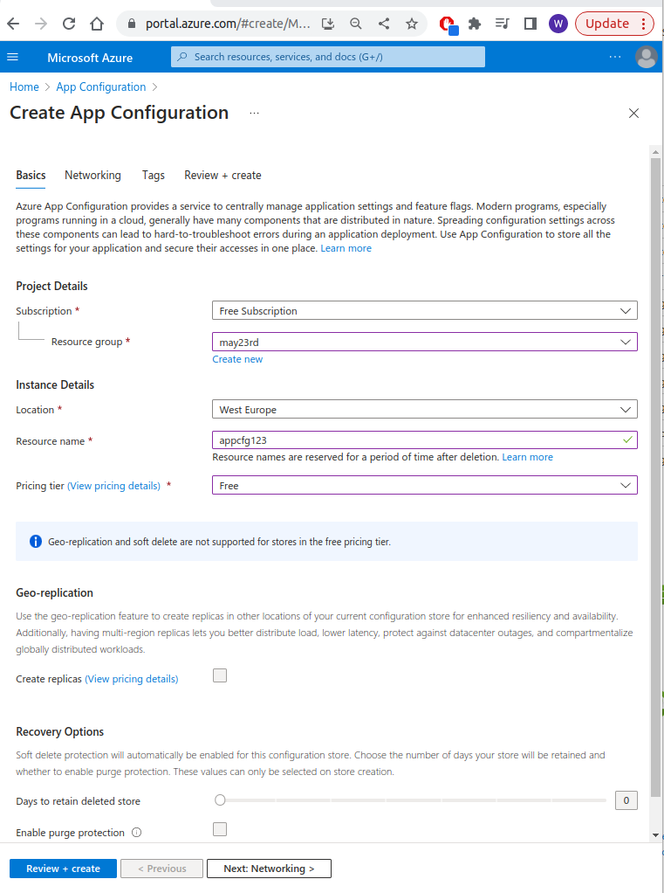

# Configurations

## Configuration strings
 -  refer to [SQL-server](../sql/creating_sql_server.md#connection-strings)
 -  it is also known as `webapp settings`

## App Configuration:

 - Docs: https://learn.microsoft.com/en-us/azure/azure-app-configuration/overview
 - https://www.udemy.com/course/azure-certification-1/learn/lecture/31940008#overview (in this video he moves connection strings into app-configuratioin service)
 - create "app configuration" (hit in the services)
   - Note there is "options for public endpoint" in Networking
   - 
 - For C# add package Microsoft.Extensions.Configuration.AzureAppConfiguration then:
   - sadf

 - See here:
   - https://github.com/wkaczurba/AzureEmployeeApp/pull/1/files
   - In Program.cs
        ```cs
        // Connection String to App Configuration:
        var connectionString = "Endpoint=https://appcfg123.azconfig.io;Id=JUYw;Secret=Mbw1mHDS/V+515c4BJH/EwEN9ZqP5dcF5JrqE7VoiHA="; 
        builder.Host.ConfigureAppConfiguration(builder =>
        {
            builder.AddAzureAppConfiguration(connectionString);
        });
        ```
   - In EmployeeService.cs:
        ```cs 
        var connectionString = _configruation["ConnectionStringAzureSql"];
        ```

### AppConfiguraiton - feature flags...

 - Add "Microsoft.FeatureManagment.AspNetCore" 
 - follow example from here: https://github.com/wkaczurba/AzureEmployeeApp/pull/2/files
 - in Program.cs:
   ```cs
        using Microsoft.Extensions.Configuration;
        using Microsoft.FeatureManagement;
        using Microsoft.FeatureManagement.FeatureFilters;

    //...

        builder.Services.AddFeatureManagement();

        // Connection String to 
        var connectionString = "Endpoint=https://appcfg123.azconfig.io;Id=OARg;Secret=xtoufiLO01kK6xgb3GnQpeFTwrNIz34JratzgdOkZ2M="; 
        builder.Host.ConfigureAppConfiguration(builder =>
        {
            builder.AddAzureAppConfiguration(options =>
            options.Connect(connectionString).UseFeatureFlags());
        });   
   ```
- in EmployeeService.cs:
    ```cs
    using Microsoft.FeatureManagement;
    // ... in class:

    private readonly IConfiguration _configruation;
    private readonly IFeatureManager _featureManager;

    public EmployeeService(IConfiguration configruation, IFeatureManager featureManager)
    {
        _configruation = configruation;
        _featureManager = featureManager;
    }

    // ...
    public async Task<bool> isBeta()
    {
        if (await _featureManager.IsEnabledAsync("beta"))
        {
            return true;
        }
        return false;
    }
    ```
