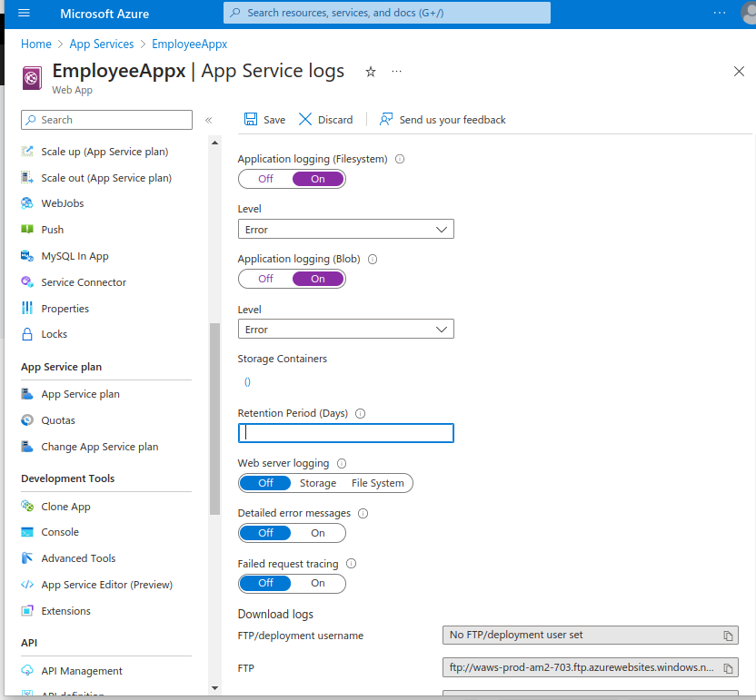
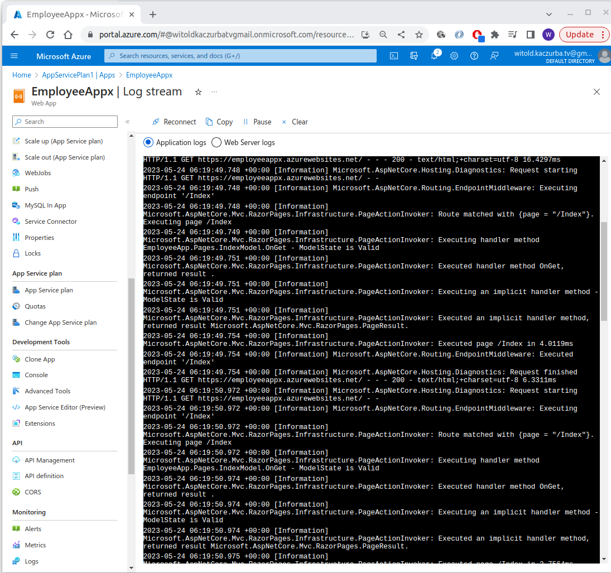

# Logs:

Types of logs:

 -  Application logging (filesystem or blob)
 -  Web server logging (off/storage/filesystem)
 -  Detailed error messages
 -  Deployment logging
  
Go into web application itself and select "App Service Logs":

Alternatively:
 - **log stream** (need to enable them first in App Service Logs)
 
 

