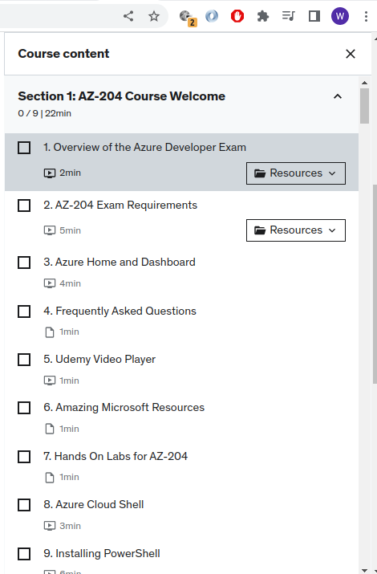

### Chrome-dev Handy scripts for extraction of text:

- Prints all items from Udemy:
  - `s=""; $$('span').filter( s => s.getAttribute('data-purpose') == 'item-title').map(x => x.textContent).forEach(x => s += x+"\n"); console.log(s);`


  - 

  Turns into:
  ``` 
  1. Overview of the Azure Developer Exam
  2. AZ-204 Exam Requirements
  3. Azure Home and Dashboard
  4. Frequently Asked Questions
  5. Udemy Video Player
  6. Amazing Microsoft Resources
  7. Hands On Labs for AZ-204
  8. Azure Cloud Shell
  9. Installing PowerShell
  10. AZ-204 Course - Starting Tips
  11. NOTE: VMs No Longer on the Exam
  12. What is a VM?
  13. Create Your First VM - The Basics
  14. Virtual Machine Availability Concepts
  15. Virtual Machine Sizes
  16. Azure VM Disks and Networking Options
  17. VM Advanced Options and the Review Page
  18. Connecting to an Azure VM - RDP and SSH
  19. Modify and Stop a VM
  20. Azure Resource Manager model (ARM) - ARM Templates
  21. Create a VM Using Powershell
  22. DEMO: Create a VM in PowerShell
  23. DEMO: Create a VM in CLI
  Quiz 1: Azure Virtual Machine Quiz
  24. IaaS vs PaaS
  25. Create an Azure Web App
  26. App Service Plan
  27. App Service Deployment Options
  28. Manual Scaling an App Service
  29. Publishing an App Service
  30. Deployment Slots
  31. App Service General Settings
  32. App Service SSL Settings
  33. Autoscaling an App Service
  34. Enable Diagnostic Logs
  35. DEMO: Create a Web App in PowerShell
  36. DEMO: Create a Web App in CLI
  37. DEMO: A look at az webapp up
  38. The WebApp Console
  Quiz 2: Azure App Service Model Quiz
  39. Code Samples: App Service
  40. What is an Azure Container Instance (ACI)?
  41. Docker Desktop and Visual Studio Container Tools
  42. Using Visual Studio to Build a Container App
  43. Deploy an ACI App From Azure Container Registry
  44. Deploy an Azure Web App From Azure Container Registry
  45. Creating a Function App
  46. Creating Our First Function
  47. HTTP Trigger Function
  48. Monitoring Function Events and Errors
  49. Adding a Blob Output Binding
  50. Timer Trigger Function
  51. Understanding Durable Functions
  52. Using NPM INSTALL in Function Apps
  53. Creating a Durable Function
  54. Adding Delays to Functions using MOMENT
  55. Function Core Tools
  56. Visual Studio and Functions
  Quiz 3: Function App Quiz
  57. INSTRUCTIONS: How to Use Microsoft Learn Exercises and Sandboxes
  58. HANDS-ON LABS: Create a Function App
  59. Code Samples: Durable Functions
  60. HANDS-ON LABS: Create a Durable Function
  61. Understanding Storage Accounts
  62. Storage Account Settings
  63. Storage Account Networking and Data Protection
  64. Storage Account Encryption
  65. Upload Files to a Storage Account
  66. Access Keys and SAS Tokens
  67. AzCopy V10
  68. StartCopyFromUri Method
  69. SetMetadata Method
  70. Storage Account Backup, Replication, and Lifecycle
  Quiz 4: Storage Account Quiz
  71. Code Samples: Azure Blobs
  72. Introduction to CosmosDB
  73. Create a CosmosDB Account
  74. Global Replication Options
  75. CosmosDB Keys and Security
  76. Create a CosmosDB Collection
  77. Add Documents to CosmosDB
  78. Setting Data Consistency Options
  79. Managing Change Feed Notifications
  Quiz 5: CosmosDB Quiz
  80. Code Samples: Cosmos DB Todo App
  81. Cosmos DB Todo App Code, Line By Line
  82. Introduction to Azure AD
  83. What is an Azure AD Tenant?
  84. Create an Azure AD Tenant
  85. Microsoft Identity Platform
  86. Create Users in Azure AD
  87. Register an Application for Azure AD
  88. Use Application Quickstart to Code an Application
  89. Overview of Microsoft Graph API
  90. Using Microsoft Graph API to Query Azure AD
  91. Code Samples: Azure Active Directory
  92. Secure App Configuration
  93. Data Encryption and Storage Accounts
  94. Data Encryption and SQL Databases
  95. Azure Key Vault
  96. Code Samples: Azure Key Vault
  97. Introduction to Redis Caching
  98. Reading and Writing to Redis in .NET
  99. Creating a CDN Profile
  100. Creating a CDN Endpoint
  101. Using a CDN in Your Application
  102. Virtual Machine Logging
  103. Function App Logging
  104. Azure Monitor
  105. API Management
  106. Configure API Management
  107. Test the API
  108. *NEW* Swagger / OpenAPI
  109. Event Grid and Event Hub
  110. Azure Storage Queues
  111. Service Bus Queue
  112. Thank You!
  113. Renewing Your Developer Certification
  114. How to Sign Up for a Free Azure Account
  Practice Test 1: Free Sample Practice Test for AZ-204
  115. Bonus: Discounts for More Courses
  ```


